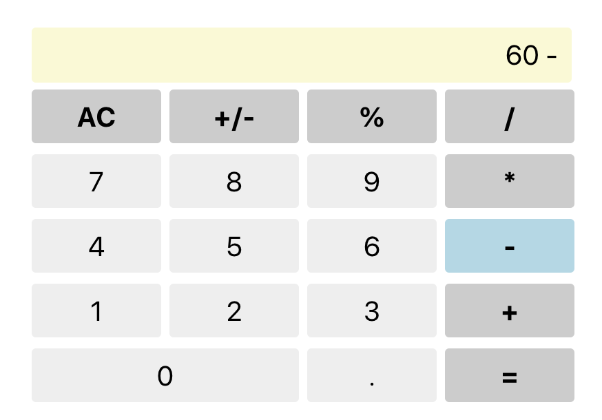

# ReactJS Calculator

This project was for the Full Stack Developer bootcamp I did.

## The Assignment

> Create a calculator using React.

<!-- ## The Solution
I have the code hosted for demo at Heroku. It may be a little slow to spin up but you can [see it here](https://dh4u-bootcamp-current-weather.herokuapp.com/). -->

## Running the Code Locally

[Clone / Download](https://github.com/dh4u/bootcamp-calculator.git) the project to your computer.

### Start the code
Open command prompt / terminal for the project folder and then you can run:

#### `npm install`

This will install the node dependencies.

#### `npm start`

Runs the app in the development mode. 
Open [http://localhost:3000](http://localhost:3000) to view it in the browser.
 
 

***
###### This project was bootstrapped with [Create React App](https://github.com/facebook/create-react-app).
